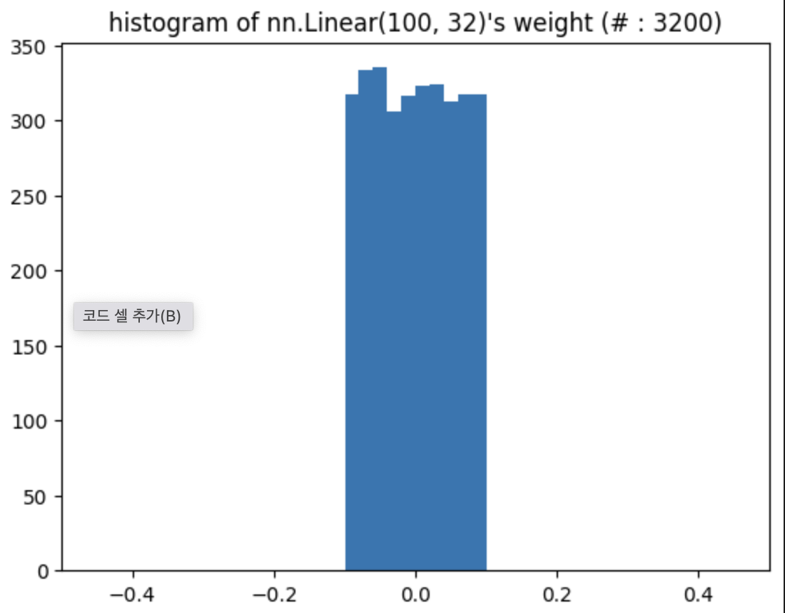

# torch.nn: Parameter vs. Linear vs. Embedding

[Audrey Wang](https://audreywongkg.medium.com/?source=post\_page-----2131e319e463--------------------------------)[Insight into PyTorch.nn: Parameter vs. Linear vs. Embedding](https://audreywongkg.medium.com/pytorch-nn-parameter-vs-nn-linear-2131e319e463)를 번역하였습니다.

## Motivation

**torch.nn.Parameter()** 클래스를 사용하면 초기값이 _1.4013e-45_처럼 매우 작다. 이로 인해 결과가 매우 이상해지기도 한다. **torch.nn.Parameter()** 대신 **torch.nn.Linear()**를 사용하면 괜찮은 값으로 초기화되는 것을 볼 수 있다.

정확히 **nn.Parameter()**와 **nn.Linear()**가 수행하는 일은 무엇일까? 또한, nn.Embedding()과의 차이는 무엇일까?

## nn.Parameter

```python
weight = torch.nn.Parameter(torch.FloatTensor(2,2))
```

이 코드는 **nn.Parameter()** 사용하여 파라미터를 생성한 예시이다. `weight`는 주어진 텐서에 의해 생성되었는데, 즉, weight의 초기값은 torch.FloatTensor(2,2)가 된 것이다. 매우 작은 값이었던 이유는 `torch.FloatTensor(2,2)`가 매우 작았기 때문이다. `torch.FloatTensor(2,2)`는 어떤 값일까?

```python
a = torch.FloatTensor(2,2)
print(a)

>> tensor([[4.6837e-39, 9.9184e-39],
           [9.0000e-39, 1.0561e-38]])
```

0에 가까운 매우 작은 값이다!

공식 가이드 문서에서는 다음과 같이 적혀있다. '`torch.Tensor()`는 `torch.FloatTensor()`의 alias다.' 그리고 [torch for numpy users notes](https://github.com/torch/torch7/wiki/Torch-for-Numpy-users#ones-and-zeros)에 따르면, `np.empty()`를 대체해 `torch.Tensor()`를 사용한다.

이제 알았다. `torch.FloatTensor()`는 빈 값을 리턴한다. 모든 요소가 0에 가까운 매우 작은 값이다. 이것이 nn.Parameter()를 사용했을 때 결과가 이상해지는 이유다. 좀 더 정확히는 **nn.Parameter()**때문이 아니라 주어진 텐서 때문이었다.

### 자체 실험

```python
parameter = torch.nn.Parameter(torch.Tensor(100, 32))
import matplotlib.pyplot as plt
plt.hist(parameter.detach().numpy().reshape(-1))
plt.xlim(-0.5, 0.5)
plt.title("histogram of nn.Parameter(torch.Tensor(100, 32))'s weights. (# : 3200)")
```

<figure><figcaption></figcaption></figure>

## nn.Linear <a href="#680c" id="680c"></a>

**`nn.Linear()`**로 만든 파라미터는 살짝 다르다. 공식 가이드 문서에 따르면, 초기화 방법은 다음과 같은데,

```python
CLASS torch.nn.Linear(in_features, out_features, bias=True)
```

bias를 False로 설정하면 **`nn.Linear()`**는 행렬변환처럼 동작한다.

```python
weight = torch.nn.Linear(2, 2, bias=False)
```

근데 위와 같이 쓰면 `weight`의 초기값은 무엇일까? [공식 문서](https://pytorch.org/docs/stable/\_modules/torch/nn/modules/linear.html#Linear)에 따르면,

```python
class Linear(Module):
    __constants__ = ['in_features', 'out_features']
    in_features: int
    out_features: int
    weight: Tensor

    def __init__(self, in_features: int, out_features: int, bias: bool = True,
                 device=None, dtype=None) -> None:
        factory_kwargs = {'device': device, 'dtype': dtype}
        super(Linear, self).__init__()
        self.in_features = in_features
        self.out_features = out_features
        self.weight = Parameter(torch.empty((out_features, in_features), **factory_kwargs))
        if bias:
            self.bias = Parameter(torch.empty(out_features, **factory_kwargs))
        else:
            self.register_parameter('bias', None)
        self.reset_parameters()

    def reset_parameters(self) -> None:
        # Setting a=sqrt(5) in kaiming_uniform is the same as initializing with
        # uniform(-1/sqrt(in_features), 1/sqrt(in_features)). For details, see
        # https://github.com/pytorch/pytorch/issues/57109
        init.kaiming_uniform_(self.weight, a=math.sqrt(5))
        if self.bias is not None:
            fan_in, _ = init._calculate_fan_in_and_fan_out(self.weight)
            bound = 1 / math.sqrt(fan_in) if fan_in > 0 else 0
            init.uniform_(self.bias, -bound, bound)
```

엥 내부에서 **nn.Parameter()**를 사용한다. **nn.Parameter()**와의 유일한 차이점은 `reset_parameters()`라는 메소드가 추가되었다는 것이다. **`nn.Linear()`**는 0을 사용하지 않고, kaiming\_uniform을 이용해 파라미터를 초기화한다. He initialization이라고도 불리는 kaiming initialization 방법은 2015년에 제안되었으며 [paperswithcode](https://paperswithcode.com/method/he-initialization)를 참고하면 좋다.

### 자체 실험

```python
linear = torch.nn.Linear(100, 32)
import matplotlib.pyplot as plt
plt.hist(linear.weight.detach().numpy().reshape(-1))
plt.xlim(-0.5, 0.5)
# plt.ylim(0, 3500)
plt.title("histogram of nn.Linear(100, 32)'s weight (# : 3200)")
```

<figure><figcaption></figcaption></figure>

## nn.Embedding

**nn.Embedding()**은 룩업테이블을 만들어 고정된 딕셔너리와 사이즈의 임베딩 값을 저장한다. 이 모듈은 보통 워드임베딩을 저장하고 인덱스로 불러오는 용도로 사용된다. 이 모듈을 사용할 때 인풋은 인덱스의 리스트이며, 해당 인덱스의 임베딩 값을 리턴받는다.

사용법은 다음과 같다.

```python
weight = nn.Embedding(num_embedding, embedding_dim)
```

`num_embedding`과 `embedding_dim`만 있으면 된다. 그렇다면 **nn.Embedding()**의 초기값은 어떻게 될까? 공식 코드에 따르면, 이 역시 **nn.Parameter()**를 사용한다. 그리고 나서 **nn.Linear()**와 마찬가지로 파라미터를 초기화하는 과정이 존재한다. 구체적으로는 **`init.normal_()`라는 메소드를 이용해 normal distribution으로 초기화한다.**

```python
from .. import init
class Embedding(Module):
    def __init__(self, num_embeddings: int, embedding_dim: int, ...):
        ...
        self.weight = Parameter(torch.empty((num_embeddings, embedding_dim), **factory_kwargs))
        self.reset_parameters()
        ...
        
    def reset_parameters(self) -> None:
        init.normal_(self.weight)
        self._fill_padding_idx_with_zero()
    
```

## ## 자체 실험

```python
embedding = torch.nn.Embedding(100, 32)
import matplotlib.pyplot as plt
plt.hist(embedding.weight.detach().numpy().reshape(-1))
plt.title("histogram of nn.Embedding(100, 32)'s weight (# : 3200)")
```

<figure><figcaption></figcaption></figure>

## Conclusion

결과적으로, **nn.Parameter()**는 텐서를 받아서 아무 초기화도 하지 않는것이다. 즉, 만약 텐서가 empty 상태 또는 초기화되지 않은 상태이면 파라미터 또한 empty, uninitialized 상태이다. 반면 **nn.Linear()**와 **nn.Embedding()**은 텐서를 각각 uniform, normal distribution으로 초기화한다. shape만 지정해주면 empty값이 아닌 파라미터를 얻을 수 있다.


